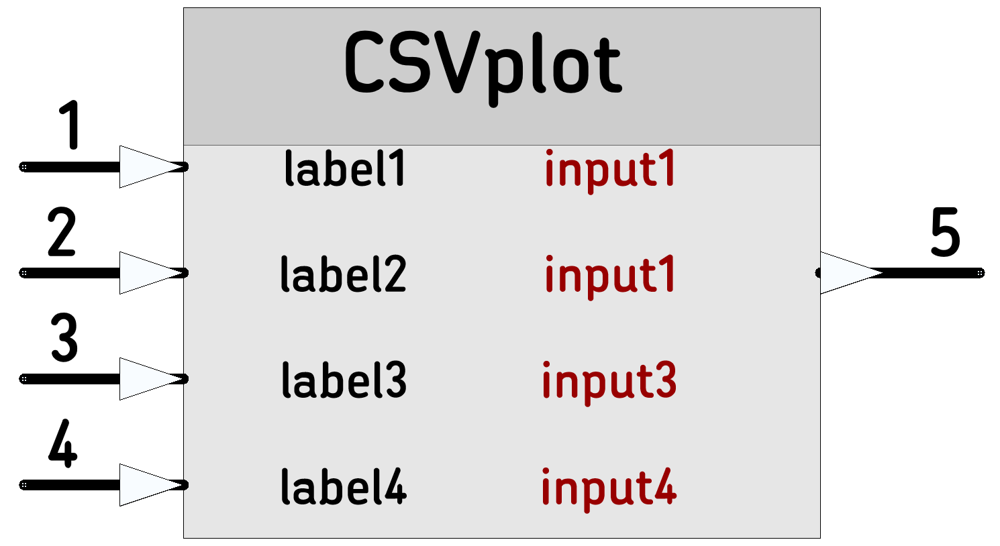

# [CSVplot](https://github.com/nBlocksStudioNodes/csvplot)

Discrete-time Signal Plotter in CSV format: Plots up to 4 signals. 

----

----

 *  Category: Math
 *  HAL: No Hardware dependencies
 *  Status:  Node is working
 *  Testing environment: LPC1768, mbed-studio, gcc, mbed-os5.15 baremetal, Arduino serial plotter
 *  Author: Nikolaos Chalikias

## Implementation details 
All inputs must be connected to a signal, or there is no output. If needed: connect inputs together. The output is created when 4 input values are aggregated. (the last of the 4 inputs, triggers the output). The first exported (printed) line contains the csv header (column names)  as used in csv files.

## Inputs/Outputs
 *  float: Input 1 ,2, 3, 4  
 *  char * (pointer to char array):  Output: String

## Parameters 
*  char * (pointer to char array): label1, 2, 3, 4: Header for the first CSV line

## Examples:

[Ticker]-->[ADC]-->(1)(2)(3)(4)[CSVplot]-->[StringSerial]  Plots ADC value, all inputs connected together

[42D_KalmanSimple_test](https://github.com/nBlocksStudioApps/42D_KalmanSimple_test_FIRMWARE)
